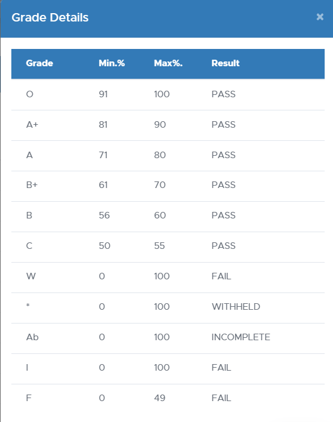
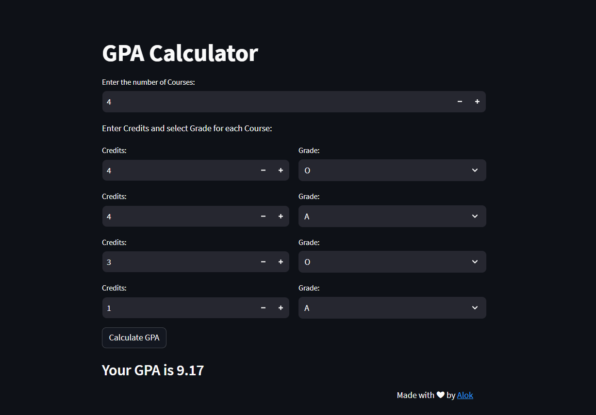

# GPA Calculator 🎓

This is a simple GPA calculator built with Streamlit which provides a user-friendly interface that helps you quickly calculate your Semester Grade Point Average (SGPA) following the Grading rules of SRM University. It takes into account the Credits and Grades for each course, and provides you with an accurate SGPA.

## Features

- Easy input of Credits and Grades for each course.
- Calculates GPA based on the provided data.
- Allows for adding more courses dynamically.

## Grade Rules

- Select 'F' for any of these grades (W, *, Ab, I and F)

## Snap

## Built With

- [Streamlit](https://www.streamlit.io/) 
- [Python](https://www.python.org/)

## Demo

## Contributing
Feel free to Contribute and Improve this GPA Calculator by creating a Pull Request or an Issue.

## License

This project is licensed under the [GNU LICENSE](LICENSE)

## Connect 

## 
### Leave a 🌟 if it was Helpful!!
### Thanks!
